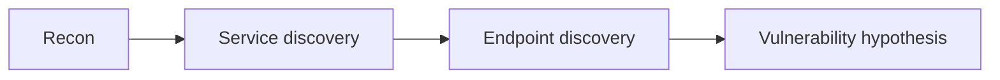

> [!abstract] Navigation
> [[Index]] | **Enumeration** | [[Exploitation]] | [[Notes]] | [[Writeup]] | [[Writeup-public]]

> [!summary]
> Scope and initial reconnaissance for `<Machine Name>`.

## Environment
| Field | Value |
|---|---|
| Victim IP | `<TARGET_IP>` |
| Attacker IP | `<ATTACKER_IP>` |
| VPN Interface | `<tun0|wg0|N/A>` |
| OS (attacker) | `<Kali|Parrot|Other>` |
| Shell | `<bash|zsh|pwsh>` |

## Scope and Objective
- Target: `<TARGET_IP_OR_HOST>`
- Objective: Identify attack surface and prioritize initial access path.

## Process Alignment
- `Pre-Engagement`:
- `Information Gathering`:
- `Vulnerability Assessment`:

## Next Skill
- `$enum-target` to generate prioritized recon commands.
- `$ctf-coach` to drive phase-aligned decisions and documentation.

## Recon Commands Executed
```bash
# Add exact commands used
```

## Port & Service Map
| Port | Proto | Service | Version | Notes |
|---|---|---|---|---|
|  |  |  |  |  |

## Key Discoveries
- 

## Discovery Evidence (Mandatory Per Relevant Finding)
### Finding `<id>`
- Summary:
- Evidence:
  ```bash
  # exact command/output excerpt
  ```
- Screenshot: `screenshots/<YYYYMMDD-HHMM>-<slug>.png`
- Screenshot evidence note:
- Decision impact:

## Attack Surface Ranking
1. 
2. 
3. 

## Phase Output
- `Information Gathering` output:
- `Vulnerability Assessment` output:

## Discovery Flow


## Tools Used
- [[Tools/Recon/Nmap|Nmap]]
- [[Tools/General-Utilities/Curl|cURL]]
