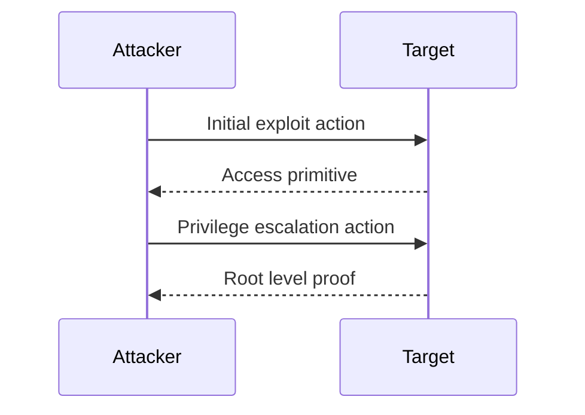

> [!abstract] Navigation
> [[Index]] | [[Enumeration]] | **Exploitation** | [[Notes]] | [[Writeup]] | [[Writeup-public]]

> [!summary]
> Exploit chain and privilege progression for `<Machine Name>`.

## Vulnerability Hypothesis
- 

## Next Skill
- `$ctf-coach` for exploit phase alignment and evidence capture.
- `$tool-doc` if a tool used here lacks a guide.

## Exploitation Phase
### Step 1
Goal:
```bash
# exact command
```
Expected signal:
Observed signal:
Screenshot: `screenshots/<YYYYMMDD-HHMM>-<slug>.png`
Screenshot evidence note:
Decision point:
Improvement candidate (if any):
Impacted skill/script:
Apply at close: `<yes|no>`

## Post-Exploitation Phase
### Step 2
Goal:
```bash
# exact command
```
Expected signal:
Observed signal:
Screenshot: `screenshots/<YYYYMMDD-HHMM>-<slug>.png`
Screenshot evidence note:
Decision point:
Improvement candidate (if any):
Impacted skill/script:
Apply at close: `<yes|no>`

## Lateral Movement Phase
### Step 3
Goal:
```bash
# exact command
```
Expected signal:
Observed signal:
Screenshot: `screenshots/<YYYYMMDD-HHMM>-<slug>.png`
Screenshot evidence note:
Decision point:
Improvement candidate (if any):
Impacted skill/script:
Apply at close: `<yes|no>`

## Proof-of-Concept Phase
### Step 4
Goal:
```bash
# exact command
```
Expected signal:
Observed signal:
Screenshot: `screenshots/<YYYYMMDD-HHMM>-<slug>.png`
Screenshot evidence note:
Decision point:
Improvement candidate (if any):
Impacted skill/script:
Apply at close: `<yes|no>`

## Phase Summary
- `Exploitation`:
- `Post-Exploitation`:
- `Lateral Movement`:
- `Proof-of-Concept`:

## Credentials Collected
| Username | Secret | Type | Source | Reuse Tested |
|---|---|---|---|---|
|  |  |  |  |  |

## Tools Used
- [[Tools/General-Utilities/Curl|cURL]]
- [[Tools/General-Utilities/SQLite3|SQLite3]]
- [[Tools/Credentials-Cracking/Hashcat|Hashcat]]
- [[Tools/Credentials-Cracking/John|John the Ripper]] (fallback only)
- [[Tools/Post-Exploitation/SSHPass|SSHPass]]

## Exploit Sequence

