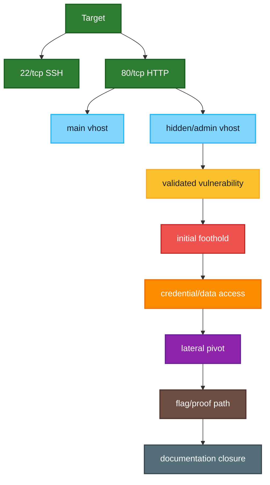

> [!abstract] Navigation
> [[Index]] | [[Enumeration]] | [[Exploitation]] | **Notes** | [[Writeup]] | [[Writeup-public]]

## Session Context
- Victim IP:
- Attacker IP:
- Mode:

## Next Skill
- `$ctf-coach` for guided phase flow.
- `$knowledge-sync` after confirmed completion.

## Attack Surface Diagram
> [!note]
> Update this diagram after each major pivot. Keep only evidence-backed nodes.
> Apply phase colors directly on attack-surface nodes/edges.



> [!warning]
> `Notes.md` is a strict operator log. Record every meaningful step in chronological order, including failed attempts and pivots.

## Timeline (Chronological Log)
- `<YYYY-MM-DD HH:MM>` Phase: `<Pre-Engagement|Information Gathering|Vulnerability Assessment|Exploitation|Post-Exploitation|Lateral Movement|Proof-of-Concept|Post-Engagement>`
  - Action:
  - Command:
    ```bash
    # exact command
    ```
  - Expected:
  - Observed:
  - Screenshot: `screenshots/<YYYYMMDD-HHMM>-<slug>.png`
  - Screenshot evidence note:
  - Decision / Pivot:
  - Improvement Candidate (if any):
  - Impacted Skill/Script:
  - Apply at Close: `<yes|no>`

## Step Log (Do Not Skip Steps)
### Step 1 - Information Gathering ^step-1
| Field | Value |
|---|---|
| Time | `<YYYY-MM-DD HH:MM>` |
| Phase | Information Gathering |
| Action |  |
| Command | `<exact command>` |
| Expected |  |
| Observed |  |
| Screenshot | `screenshots/<YYYYMMDD-HHMM>-<slug>.png` |
| Screenshot Evidence |  |
| Decision |  |
| Improvement Candidate |  |
| Impacted Skill/Script |  |
| Apply at Close | `<yes|no>` |

### Step 2 - Vulnerability Assessment ^step-2
| Field | Value |
|---|---|
| Time | `<YYYY-MM-DD HH:MM>` |
| Phase | Vulnerability Assessment |
| Action |  |
| Command | `<exact command>` |
| Expected |  |
| Observed |  |
| Screenshot | `screenshots/<YYYYMMDD-HHMM>-<slug>.png` |
| Screenshot Evidence |  |
| Decision |  |
| Improvement Candidate |  |
| Impacted Skill/Script |  |
| Apply at Close | `<yes|no>` |

### Step 3 - Exploitation ^step-3
| Field | Value |
|---|---|
| Time | `<YYYY-MM-DD HH:MM>` |
| Phase | Exploitation |
| Action |  |
| Command | `<exact command>` |
| Expected |  |
| Observed |  |
| Screenshot | `screenshots/<YYYYMMDD-HHMM>-<slug>.png` |
| Screenshot Evidence |  |
| Decision |  |
| Improvement Candidate |  |
| Impacted Skill/Script |  |
| Apply at Close | `<yes|no>` |

### Step 4 - Post-Exploitation ^step-4
| Field | Value |
|---|---|
| Time | `<YYYY-MM-DD HH:MM>` |
| Phase | Post-Exploitation |
| Action |  |
| Command | `<exact command>` |
| Expected |  |
| Observed |  |
| Screenshot | `screenshots/<YYYYMMDD-HHMM>-<slug>.png` |
| Screenshot Evidence |  |
| Decision |  |
| Improvement Candidate |  |
| Impacted Skill/Script |  |
| Apply at Close | `<yes|no>` |

### Step 5 - Lateral Movement ^step-5
| Field | Value |
|---|---|
| Time | `<YYYY-MM-DD HH:MM>` |
| Phase | Lateral Movement |
| Action |  |
| Command | `<exact command>` |
| Expected |  |
| Observed |  |
| Screenshot | `screenshots/<YYYYMMDD-HHMM>-<slug>.png` |
| Screenshot Evidence |  |
| Decision |  |
| Improvement Candidate |  |
| Impacted Skill/Script |  |
| Apply at Close | `<yes|no>` |

### Step 6 - Proof-of-Concept ^step-6
| Field | Value |
|---|---|
| Time | `<YYYY-MM-DD HH:MM>` |
| Phase | Proof-of-Concept |
| Action |  |
| Command | `<exact command>` |
| Expected |  |
| Observed |  |
| Screenshot | `screenshots/<YYYYMMDD-HHMM>-<slug>.png` |
| Screenshot Evidence |  |
| Decision |  |
| Improvement Candidate |  |
| Impacted Skill/Script |  |
| Apply at Close | `<yes|no>` |

## Decision Quality Log (Hypotheses & Signals)
| Hypothesis | Evidence/Source | Expected Signal | Result | Pivot? |
|---|---|---|---|---|
| | | | | |

## Dead Ends / Rabbit Holes
- 

## Evidence Captured
- 

## Local Artifacts Created (Manifest)
| Artifact | Source/Transformation | Purpose | SHA256 (first 12) |
|---|---|---|---|
| `artifacts/` | | | |

> Generate with: `sha256sum <file> | cut -c1-12`

## Tools Used
- [[Tools/Recon/Nmap|Nmap]]
- [[Tools/General-Utilities/Curl|cURL]]
