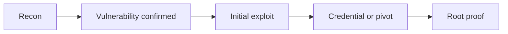

<!--
WRITEUP CREATION WORKFLOW:
Create THIS FILE SECOND (after Writeup.md):
1. Copy the entire content from Writeup.md
2. Replace ALL sensitive values with semantic placeholders:
   - Passwords: <x_user_password>, <x_admin_password>
   - Flags: <x_flag_value>, <x_user_flag>, <x_root_flag>
   - API Keys: <x_api_key>, <x_jwt_token>
   - Hashes: <x_password_hash>, <x_nt_hash>
3. Keep the EXACT same structure, commands, and methodology
4. Maintain full reproducibility - only replace secret values
5. GitHub compatibility: use [label](relative/path.md) links, NOT [[wiki-links]]
6. GitHub compatibility: use > **Note** bold blockquotes, NOT > **Note** callouts
7. Source reference: use repo-relative path, NOT /mnt/c/Users/...
-->

**Navigate:** [Index](Index.md) | [Enumeration](Enumeration.md) | [Exploitation](Exploitation.md) | [Notes](Notes.md) | [Writeup](Writeup.md) | **Writeup-public**

> **Summary**
> Public machine writeup that remains reproducible end-to-end.

## Scope
- Target:
- Authorization:

## Reproduction Preconditions
| Field | Value |
|---|---|
| Reset state required | `<yes|no>` |
| Network/VPN |  |
| Required local tools |  |
| Required local files |  |

## Command Budget and Runtime Notes
- Estimated total runtime:
- Rate limits/throttling observed:
- Commands requiring retries:

## Pentesting Process Trace
| Phase | Action | Output |
|---|---|---|
| Pre-Engagement |  |  |
| Information Gathering |  |  |
| Vulnerability Assessment |  |  |
| Exploitation |  |  |
| Post-Exploitation |  |  |
| Lateral Movement |  |  |
| Proof-of-Concept |  |  |
| Post-Engagement |  |  |

## Summary of Major Findings
Expected: `<what signal should have confirmed the core attack path>`
Observed: `<what actually confirmed the path>`

Expected: `<what signal should have confirmed the privesc / final proof path>`
Observed: `<what actually confirmed the final proof path>`

> **Screenshot** Evidence Placeholder
> Path: `screenshots/<YYYYMMDD-HHMM>-<slug>.png`
> Evidence: `<what this screenshot proves>`

## Platform Answer Confirmation (If Applicable)
- Platform answer tracking enabled: `<yes|no>`
- Confirmed on host/IP: `<target ip>`
- Validation date: `<YYYY-MM-DD>`
- Note: Use this section for THM sequential questions and for HTB machine answer tracking (for example `user` and `root` flags). Redact answers with stable placeholders.
- Single-flag target note (optional): remove `Q2+` entries and keep a single redacted answer placeholder.

### Q1. <platform question or canonical label>
Answer: `<x_answer_1>`

### Q2. <platform question or canonical label>
Answer: `<x_answer_2>`

## Step-by-Step Reproduction
### Step 1 - Information Gathering
```bash
# exact commands
```
Expected signal:
Observed signal:
Screenshot: `screenshots/<YYYYMMDD-HHMM>-<slug>.png`
Screenshot evidence note:
Decision point:

### Step 2 - Vulnerability Assessment
```bash
# exact commands
```
Expected signal:
Observed signal:
Screenshot: `screenshots/<YYYYMMDD-HHMM>-<slug>.png`
Screenshot evidence note:
Decision point:

### Step 3 - Exploitation
```bash
# exact commands
```
Expected signal:
Observed signal:
Screenshot: `screenshots/<YYYYMMDD-HHMM>-<slug>.png`
Screenshot evidence note:
Decision point:

### Step 4 - Post-Exploitation
```bash
# exact commands
```
Expected signal:
Observed signal:
Screenshot: `screenshots/<YYYYMMDD-HHMM>-<slug>.png`
Screenshot evidence note:
Decision point:

### Step 5 - Lateral Movement
```bash
# exact commands
```
Expected signal:
Observed signal:
Screenshot: `screenshots/<YYYYMMDD-HHMM>-<slug>.png`
Screenshot evidence note:
Decision point:

### Step 6 - Proof-of-Concept
```bash
# exact commands
```
Expected signal:
Observed signal:
Screenshot: `screenshots/<YYYYMMDD-HHMM>-<slug>.png`
Screenshot evidence note:
Decision point:

## Dead Ends
| Attempt | Why It Failed | Time Spent |
|---|---|---|
|  |  |  |

> **Tip**
> Include dead ends so others do not waste time repeating low-signal paths.

## Redaction Log
| Original Context | Placeholder | Reason |
|---|---|---|
|  |  |  |

> **Warning**
> Verify all placeholders appear in the walkthrough before publishing.

## Reproducibility Notes
> **Note**
> Keep commands executable as written. Replace only environment-specific values (IP, user names, and ports).
> For single-flag targets, explicitly mark non-applicable machine fields as `N/A` instead of leaving placeholders.

## Proof Artifacts
| Claim | Artifact Path | Validation Command |
|---|---|---|
|  |  |  |

## Validation Checklist
- [ ] Every command can be copy-pasted and run as-is (no pseudocode)
- [ ] All IPs and ports match the Scope/Environment sections
- [ ] Each step has Expected and Observed output
- [ ] Flags section is filled (or marked N/A)
- [ ] Mermaid diagram renders without errors
- [ ] No credentials or sensitive data are exposed
- [ ] Walkthrough tested on a fresh reset of the machine

## Recovered Credentials (Non-Flag)
- <x_user>: <x_secret>

## Reusable Improvements
- <tool to document>
- <new quickcheck>
- <template or procedure update>

## Tools Used
- [Nmap](../../Tools/Recon/Nmap.md)
- [cURL](../../Tools/General-Utilities/Curl.md)

## Attack Flow

