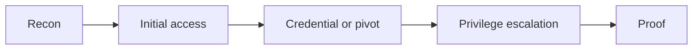

<!--
WRITEUP CREATION WORKFLOW:
1. Create THIS FILE (Writeup.md) FIRST with ALL actual values:
   - Include actual passwords, flags, keys, hashes, tokens in cleartext
   - NO placeholders - use every real value discovered
   - This is the complete private reference
2. Create Writeup-public.md SECOND by copying this file and redacting secrets
   - Replace ALL sensitive values with semantic placeholders (<x_user_password>, <x_flag_value>)
   - Keep identical structure, commands, and methodology for full reproducibility
-->

> [!abstract] Navigation
> [[Index]] | [[Enumeration]] | [[Exploitation]] | [[Notes]] | **Writeup** | [[Writeup-public]]

> [!summary]
> Final machine writeup for `<Machine Name>`.

## Pentesting Process Trace
| Phase | What Was Done | Output |
|---|---|---|
| Pre-Engagement |  |  |
| Information Gathering |  |  |
| Vulnerability Assessment |  |  |
| Exploitation |  |  |
| Post-Exploitation |  |  |
| Lateral Movement |  |  |
| Proof-of-Concept |  |  |
| Post-Engagement |  |  |

## Platform Answer Confirmation (If Applicable)
- Platform answer tracking enabled: `<yes|no>`
- Confirmed on host/IP: `<target ip>`
- Validation date: `<YYYY-MM-DD>`
- Note: Use this section for THM sequential questions and for HTB machine answer tracking (for example `user` and `root` flags) when explicit answer documentation is desired.
- Single-flag target note (optional): remove `Q2+` entries and keep only the one platform question/answer block.

### Q1. <platform question or canonical label>
Answer: `<answer>`

### Q2. <platform question or canonical label>
Answer: `<answer>`

## Attack Chain
1. 
2. 
3. 

## Reproducible Walkthrough (Step by Step)
### Step 1 - Information Gathering
Objective:
```bash
# exact commands
```
Expected:
Observed:
Decision:

### Step 2 - Vulnerability Assessment
Objective:
```bash
# exact commands
```
Expected:
Observed:
Decision:

### Step 3 - Exploitation
Objective:
```bash
# exact commands
```
Expected:
Observed:
Decision:

### Step 4 - Post-Exploitation
Objective:
```bash
# exact commands
```
Expected:
Observed:
Decision:

### Step 5 - Lateral Movement
Objective:
```bash
# exact commands
```
Expected:
Observed:
Decision:

### Step 6 - Proof-of-Concept
Objective:
```bash
# exact commands
```
Expected:
Observed:
Decision:

## Key Evidence
```text
# Paste decisive outputs
```

## Flags
- User flag:
- Root flag: `<N/A for single-flag targets>`

## Recovered Credentials (Non-Flag)
- <user>: <secret>

## Reusable Lessons
- 

## Reusable Improvements
- <tool to document>
- <new quickcheck>
- <template or procedure update>

## Remediation
| Vulnerability | Fix | Priority |
|---|---|---|
|  |  |  |

## Validation Checklist
- [ ] Every command can be copy-pasted and run as-is (no pseudocode)
- [ ] All IPs and ports match the Scope/Environment sections
- [ ] Each step has Expected and Observed output
- [ ] Flags section is filled (or marked N/A)
- [ ] Mermaid diagram renders without errors
- [ ] Walkthrough tested on a fresh reset of the machine

## Tools Used
- [[Tools/Recon/Nmap|Nmap]]
- [[Tools/General-Utilities/Curl|cURL]]

## Final Attack Graph

